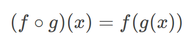

# compose

[![Build status][travis-image]][travis-url]
[![Git tag][git-image]][git-url]
[![NPM version][npm-image]][npm-url]
[![Code style][standard-image]][standard-url]

Right-to-left function composition for two or more functions.



## What is it?

If you aren't familiar with function composition you can read all about it [here](http://scott.sauyet.com/Javascript/Talk/Compose/2013-05-22/#slide-0).

## Installation

    $ npm install @f/compose

## Usage

```js
var compose = require('@f/compose')

var times2plus1 = compose(plus1, times2)
// times2plus1(3) -> 7

function plus1 (x) {
  return x + 1
}

function times2 (x) {
  return x * 2
}
```

## API

### compose(...fns)

- `fns` - List of functions to compose

**Returns:** A new function which when called with arguments, pipes those through `fns` from right-to-left

## License

MIT

[travis-image]: https://img.shields.io/travis/micro-js/compose.svg?style=flat-square
[travis-url]: https://travis-ci.org/micro-js/compose
[git-image]: https://img.shields.io/github/tag/micro-js/compose.svg?style=flat-square
[git-url]: https://github.com/micro-js/compose
[standard-image]: https://img.shields.io/badge/code%20style-standard-brightgreen.svg?style=flat-square
[standard-url]: https://github.com/feross/standard
[npm-image]: https://img.shields.io/npm/v/@f/compose.svg?style=flat-square
[npm-url]: https://npmjs.org/package/@f/compose
